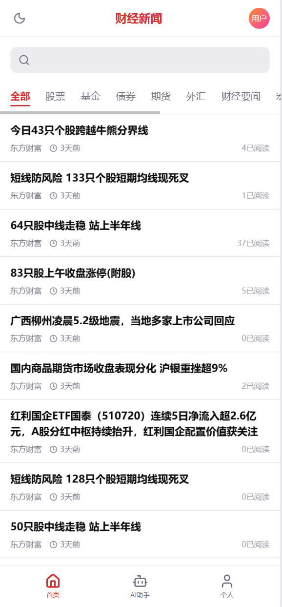
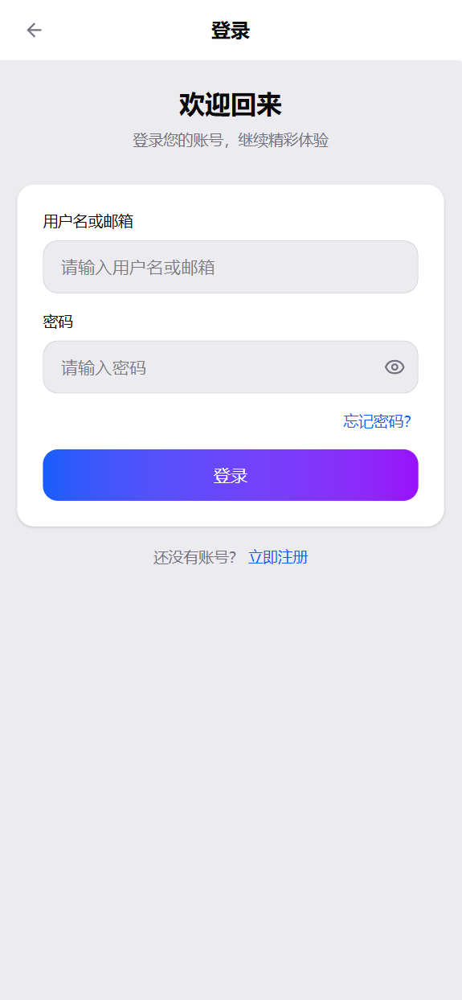
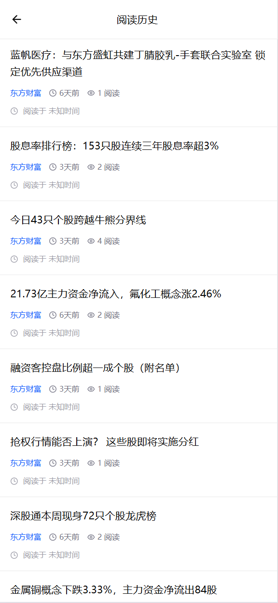
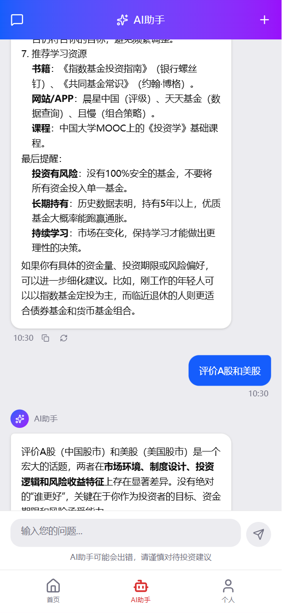
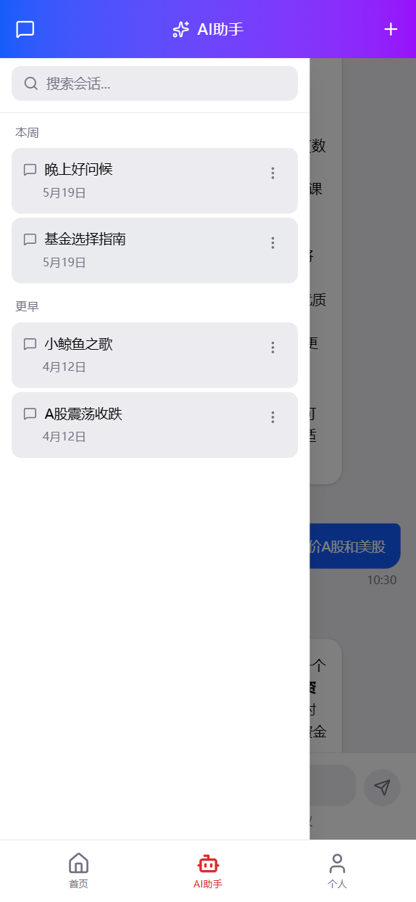
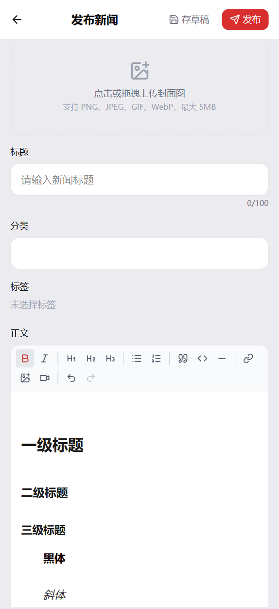
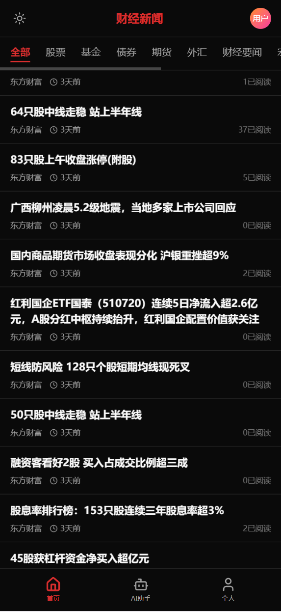

# 财经新闻 - Vue 前端

基于 Vue 3 + TypeScript + Vite 构建的财经新闻平台前端，提供新闻浏览、搜索、收藏、AI 助手、富文本编辑器等功能。

后端仓库：[FinancialNews-Backend](https://github.com/Jimkk111/FinancialNews-Backend.git)

## 技术栈

| 类别 | 技术 |
|------|------|
| 框架 | Vue 3.5 + Composition API |
| 语言 | TypeScript 5.9 |
| 构建 | Vite 7 |
| 状态管理 | Pinia 3 |
| 路由 | Vue Router 5 |
| UI 样式 | Tailwind CSS v4 |
| 组件库 | Radix Vue |
| HTTP | Axios |
| 图标 | Lucide Vue Next |
| 富文本 | Tiptap 3 |
| Markdown | Marked |
| 虚拟滚动 | vue-virtual-scroller |

## 功能概览

### 新闻浏览

- **首页推荐**：新闻列表支持分类筛选（最新/热门）

- **详情页**：完整正文、来源、发布时间，支持 Markdown 渲染

- **分类与标签**：按分类浏览，标签聚合

  

### 用户系统

- 注册/登录，支持验证码发送和密码重置

- JWT Token 认证，自动注入请求头

- 401 自动清除本地状态

  

### 收藏与历史

- 新闻收藏（添加/取消），收藏列表分页浏览
- 浏览历史自动记录，支持清空




### AI 助手

- 多会话管理，可创建、重命名、删除会话
- 流式响应的聊天体验（SSE）
- 快捷操作入口





### 新闻编辑器

- **Tiptap 富文本编辑器**：支持图片、链接、YouTube 视频嵌入
- **草稿系统**：创建、编辑、删除草稿，自动保存
- **发布管理**：发布新闻、查看已发布列表
- **媒体上传**：图片和视频上传



### 深色模式

- 支持亮色/暗色/跟随系统三种模式
- 页面刷新不闪烁（inline script 预判）



## 项目结构

```
src/
├── api/                  # API 请求层
│   ├── request.ts        # Axios 实例、拦截器、请求方法封装
│   ├── auth.ts           # 认证相关 API
│   ├── news.ts           # 新闻相关 API
│   ├── user.ts           # 用户相关 API
│   ├── ai.ts             # AI 助手 API（含流式）
│   ├── draft.ts          # 草稿/发布 API
│   ├── favorite.ts       # 收藏 API
│   └── history.ts        # 历史记录 API
├── services/             # 业务逻辑层
│   ├── newsService.ts    # 新闻业务
│   ├── userService.ts    # 用户业务
│   ├── newsEditorService.ts  # 编辑器业务
│   └── aiService.ts       # AI 业务
├── stores/               # Pinia 状态管理
│   ├── auth.ts           # 用户认证状态
│   ├── theme.ts          # 主题状态
│   └── aiSession.ts      # AI 会话状态
├── router/               # 路由配置
├── views/                # 页面组件
│   ├── Home.vue          # 首页
│   ├── NewsDetail.vue    # 新闻详情
│   ├── Login.vue         # 登录
│   ├── Register.vue      # 注册
│   ├── ForgotPassword.vue # 忘记密码
│   ├── Profile.vue       # 个人中心
│   ├── PersonalInfo.vue  # 个人信息编辑
│   ├── Collection.vue    # 我的收藏
│   ├── History.vue       # 浏览历史
│   ├── SearchResults.vue # 搜索结果
│   ├── NewsEditor.vue    # 新闻编辑器
│   ├── Drafts.vue        # 草稿箱
│   ├── MyPublished.vue   # 已发布新闻
│   └── AIAssistant/      # AI 助手模块
├── components/           # 公共组件
│   ├── Header.vue        # 顶部导航
│   ├── BottomNav.vue     # 底部导航（移动端）
│   ├── SearchBar.vue     # 搜索栏
│   ├── NewsList.vue      # 新闻列表（含虚拟滚动）
│   ├── NewsItem.vue      # 新闻卡片
│   ├── CategoryTabs.vue  # 分类标签页
│   ├── Avatar.vue        # 头像组件
│   └── editor/           # 编辑器组件
├── types/                # TypeScript 类型定义
├── utils/                # 工具函数
├── styles/               # 全局样式
├── App.vue
└── main.ts
```

## 环境变量

| 变量 | 说明 | 开发环境 | 生产环境 |
|------|------|----------|----------|
| `VITE_API_BASE_URL` | API 基础地址 | `http://localhost:3000/api` | 替换为实际域名 |

配置文件：
- `.env` — 通用配置
- `.env.development` — 开发环境
- `.env.production` — 生产环境

## 本地开发

### 环境要求

- Node.js >= 20.19.0 或 >= 22.12.0
- 后端 API 服务运行在 `http://localhost:8000`

### 安装与启动

```bash
# 安装依赖
npm install

# 启动开发服务器
npm run dev
```

开发服务器默认运行在 `http://localhost:5173`，API 请求通过 Vite proxy 转发到 `http://localhost:8000`。

### 可用命令

```bash
npm run dev          # 启动开发服务器
npm run build        # 类型检查 + 构建
npm run build-only   # 仅构建
npm run type-check   # 仅类型检查
npm run preview      # 预览生产构建
```

## 代理配置

开发环境下 `/api` 请求会被 Vite 代理转发：

```ts
// vite.config.ts
server: {
  proxy: {
    '/api': {
      target: 'http://localhost:8000',
      changeOrigin: true,
    },
  },
}
```

如果使用了 `VITE_API_BASE_URL` 环境变量指定了完整的 API 地址，Axios 实例会直接请求该地址而不经过代理。

## 构建优化

生产构建将以下库拆分为独立 chunk：

- **vendor-tiptap**：Tiptap 编辑器相关包
- **vendor-icons**：Lucide 图标库

页面组件采用路由懒加载 (`() => import(...)`)。

## 浏览器支持

支持所有现代浏览器（ES Module 兼容）。
