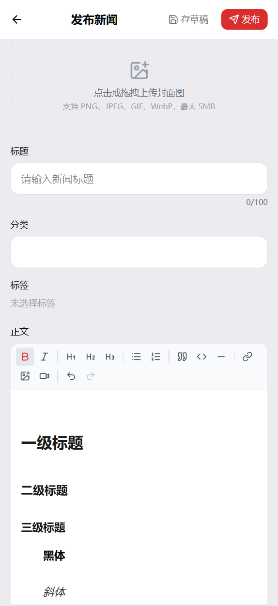
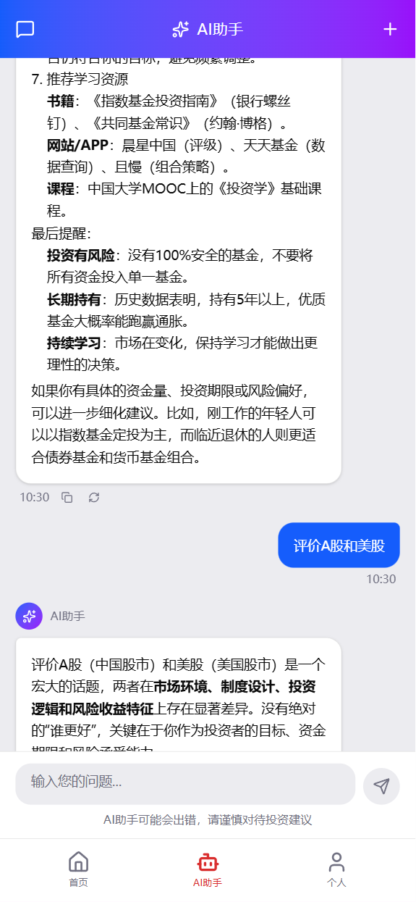
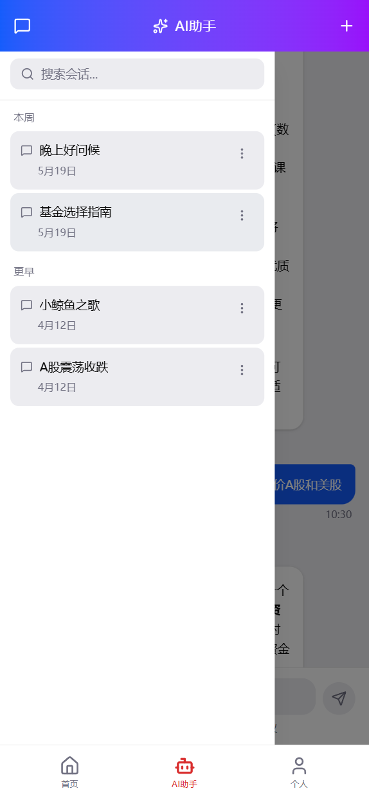
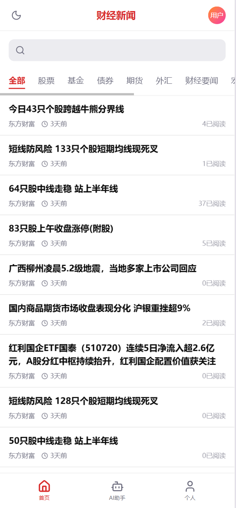
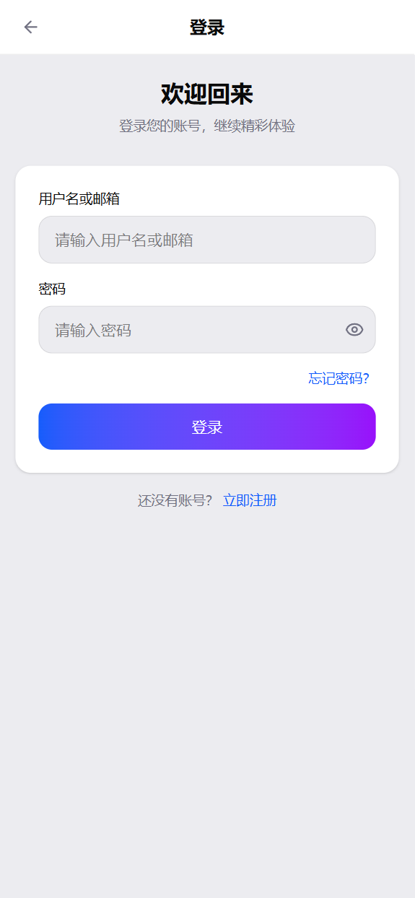
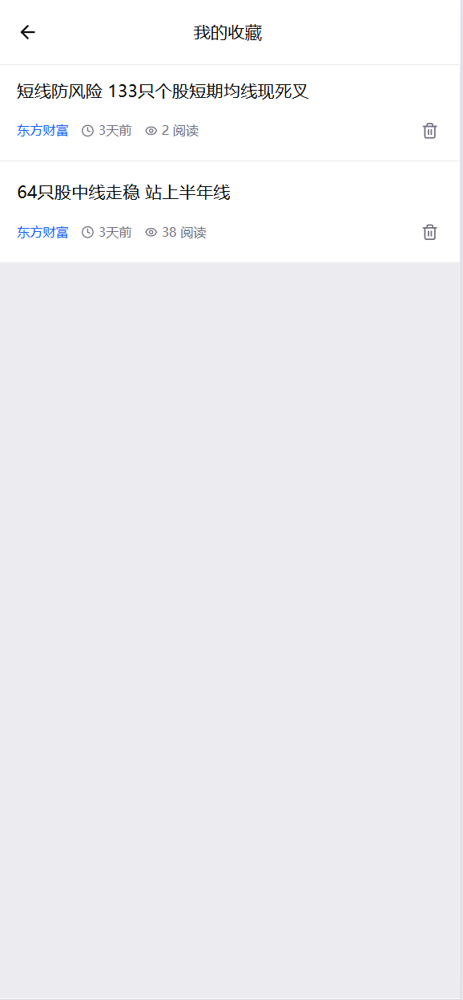
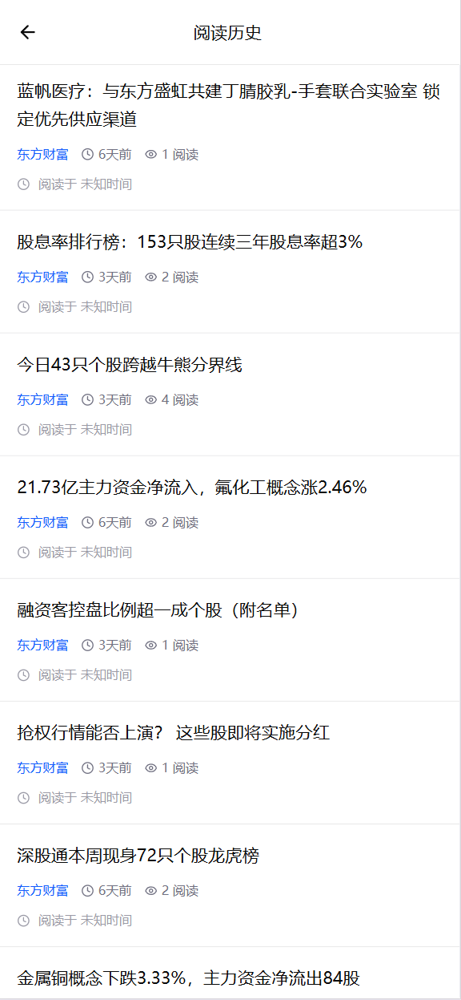
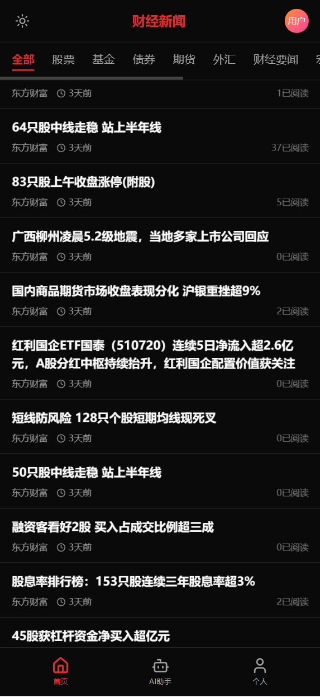

# 财经新闻 - Vue 前端

基于 Vue 3 + TypeScript + Vite 构建的财经新闻平台前端，提供新闻浏览、搜索、收藏、AI 智能助手、富文本内容创作等完整功能。

后端仓库：[FinancialNews-Backend](https://github.com/Jimkk111/FinancialNews-Backend.git)

## 技术栈

| 类别 | 技术 |
|------|------|
| 框架 | Vue 3.5 + Composition API |
| 语言 | TypeScript 5.9 |
| 构建 | Vite 7 |
| 状态管理 | Pinia 3 |
| 路由 | Vue Router 5 |
| UI 样式 | Tailwind CSS v4 |
| 组件库 | Radix Vue |
| HTTP | Axios |
| 图标 | Lucide Vue Next |
| 富文本 | Tiptap 3 |
| Markdown | Marked |
| 虚拟滚动 | vue-virtual-scroller |

## 核心特性

### 富文本内容创作系统

基于 Tiptap 3 构建富文本编辑器，为新闻内容提供丰富的排版能力：

- **基础排版**：标题（H1–H3）、粗体、斜体、引用、代码块、有序/无序列表、分割线
- **媒体嵌入**：图片上传、视频上传、链接插入
- **自定义节点扩展**：通过 `Video` 自定义 Node 拓展 Tiptap 的原生能力，实现视频块的编辑与渲染
- **块级 JSON 数据模型**：设计独立的 `ArticleContent` 块级 JSON Schema 作为编辑、存储、渲染三方共用的唯一契约，编辑器内部 ProseMirror 文档树与块级 JSON 通过 `tiptapToBlocks` / `blocksToTiptap` 双向同步
- **组件化渲染**：正文展示完全不使用 `v-html`，而是通过 `blockMap` 将每种 block type 分发到独立 Vue 组件（`BlockParagraph`、`BlockHeading`、`BlockImage`、`BlockVideo` 等）渲染，杜绝 XSS 风险



### AI 智能助手集成

实现完整的 AI Chatbot 功能，覆盖会话管理、流式对话、状态持久化：

- **SSE 流式输出**：基于 `fetch` + `ReadableStream` 实现 POST 方式的 SSE 流式对话，逐 chunk 实时渲染 AI 回复，消息状态细粒度追踪（`streaming` → `complete` / `error`）
- **多会话管理**：支持创建、重命名、删除会话，会话列表按时间自动分组（今天/昨天/本周/更早），支持关键词搜索过滤
- **Pinia 状态管理**：`aiSession` Store 集中管理会话列表、当前会话、消息队列、加载状态；通过原地修改消息对象属性触发 Vue 精确响应式更新，避免数组替换导致依赖追踪失效
- **localStorage 持久化**：会话列表摘要和最近会话 ID 持久化到 localStorage，页面刷新后自动恢复上次对话上下文；后端 API 优先、失败时降级读取本地缓存
- **空闲超时机制**：流式响应 30 秒无新数据自动中止，防止连接悬挂





### 性能优化

- **路由懒加载**：所有页面组件均通过 `() => import(...)` 动态导入，实现路由级别代码分割，减少首屏资源体积
- **虚拟列表**：基于 `vue-virtual-scroller` 的 `DynamicScroller` 组件实现新闻列表虚拟滚动，仅渲染可视区域内的 DOM 节点，避免长列表内存溢出；配合 `IntersectionObserver` API 实现触底自动加载更多
- **KeepAlive 缓存**：`App.vue` 中通过 `<keep-alive :include="['Home']">` 缓存首页组件，从详情页/其他页面返回时无需重新请求新闻数据
- **构建拆包**：Vite `manualChunks` 将 Tiptap 编辑器和 Lucide 图标库拆为独立 chunk（`vendor-tiptap`、`vendor-icons`），避免单文件过大



### 安全与鉴权

- **统一 Axios 实例**：封装单一 `request` 实例，统一配置请求/响应拦截器；响应拦截器自动解包后端 `{ code, data, msg }` 统一格式，分页响应自动映射为 `{ data, pagination }` 结构
- **HttpOnly Cookie + 自动探测**：JWT 通过 HttpOnly Cookie 传输（`withCredentials: true`），前端 JS 无法读取 Token；页面刷新时通过 `GET /users/me` 探测登录态，401 自动清空内存状态
- **路由守卫**：`router.beforeEach` 拦截受保护路由，等待登录态探测完成后判断是否跳转登录页
- **业务错误封装**：`ApiError` 类携带错误码、消息和字段级详情，支持表单验证错误的精确展示



### 其他功能

- **新闻浏览**：首页推荐、分类筛选（最新/热门）、标签聚合、搜索
- **用户系统**：注册/登录、验证码发送、密码重置、个人信息编辑
- **收藏与历史**：新闻收藏管理、浏览历史自动记录与清空





### 深色模式

- 支持亮色/暗色/跟随系统三种模式
- 页面刷新不闪烁（inline script 预判）



## 项目结构

```
src/
├── api/                      # API 请求层
│   ├── request.ts            # 统一 Axios 实例、拦截器、ApiError、请求方法封装
│   ├── auth.ts               # 认证相关 API
│   ├── news.ts               # 新闻相关 API
│   ├── user.ts               # 用户相关 API
│   ├── ai.ts                 # AI 助手 API（含 SSE 流式）
│   ├── draft.ts              # 草稿/发布 API
│   ├── favorite.ts           # 收藏 API
│   ├── history.ts            # 历史记录 API
│   └── crawler.ts            # 爬虫相关 API
├── services/                 # 业务逻辑层
│   ├── newsService.ts        # 新闻业务
│   ├── userService.ts        # 用户业务
│   ├── newsEditorService.ts  # 编辑器业务（含媒体上传）
│   └── aiService.ts          # AI 业务（流式对话编排）
├── stores/                   # Pinia 状态管理
│   ├── auth.ts               # 用户认证状态（HttpOnly Cookie 探测）
│   ├── theme.ts              # 主题状态（亮/暗/跟随系统）
│   └── aiSession.ts          # AI 会话状态（会话列表 + 消息队列 + localStorage 持久化）
├── router/                   # 路由配置（懒加载 + 鉴权守卫）
├── views/                    # 页面组件
│   ├── Home.vue              # 首页（KeepAlive 缓存）
│   ├── NewsDetail.vue        # 新闻详情（Markdown 渲染）
│   ├── Login.vue             # 登录
│   ├── Register.vue          # 注册
│   ├── ForgotPassword.vue    # 忘记密码
│   ├── Profile.vue           # 个人中心
│   ├── PersonalInfo.vue      # 个人信息编辑
│   ├── Collection.vue        # 我的收藏
│   ├── History.vue           # 浏览历史
│   ├── SearchResults.vue     # 搜索结果
│   ├── NewsEditor.vue        # 新闻编辑器
│   ├── Drafts.vue            # 草稿箱
│   ├── MyPublished.vue       # 已发布新闻
│   └── AIAssistant/          # AI 助手模块
│       ├── index.vue         # 主布局（侧边栏 + 聊天区）
│       ├── ChatArea.vue      # 聊天消息区域
│       ├── InputArea.vue     # 输入区域
│       ├── MessageBubble.vue # 消息气泡
│       ├── QuickActions.vue  # 快捷操作
│       ├── SessionSidebar.vue # 会话侧边栏
│       └── SessionItem.vue   # 会话列表项
├── components/               # 公共组件
│   ├── Header.vue            # 顶部导航
│   ├── BottomNav.vue         # 底部导航（移动端）
│   ├── SearchBar.vue         # 搜索栏
│   ├── NewsList.vue          # 新闻列表（DynamicScroller 虚拟滚动 + IntersectionObserver 无限加载）
│   ├── NewsItem.vue          # 新闻卡片
│   ├── CategoryTabs.vue      # 分类标签页
│   ├── Avatar.vue            # 头像组件
│   ├── editor/               # 编辑器组件
│   │   ├── TiptapEditor.vue  # Tiptap 富文本编辑器
│   │   ├── ImageUploader.vue # 图片上传
│   │   ├── TagSelector.vue   # 标签选择
│   │   └── extensions/
│   │       └── Video.ts      # 自定义 Video 节点扩展
│   ├── content/              # 正文渲染组件（组件化渲染，无 v-html）
│   │   ├── ArticleContent.vue # 渲染入口（block type 分发）
│   │   ├── InlineText.vue    # 行内文本（含 marks）
│   │   └── blocks/           # 各 block type 对应组件
│   │       ├── BlockParagraph.vue
│   │       ├── BlockHeading.vue
│   │       ├── BlockList.vue
│   │       ├── BlockBlockquote.vue
│   │       ├── BlockCode.vue
│   │       ├── BlockImage.vue
│   │       ├── BlockVideo.vue
│   │       ├── BlockDivider.vue
│   │       └── index.ts      # blockMap 注册表
│   └── ui/                   # 通用 UI 组件
├── types/                    # TypeScript 类型定义
│   ├── content.ts            # 块级 JSON 数据模型（ArticleContent Schema）
│   ├── ai.ts                 # AI 相关类型
│   ├── news.ts               # 新闻相关类型
│   ├── user.ts               # 用户相关类型
│   └── common.ts             # 通用类型
├── utils/                    # 工具函数
│   ├── format.ts             # 格式化工具
│   └── content/              # 内容转换工具
│       ├── tiptapToBlocks.ts # Tiptap JSON → 块级 JSON
│       ├── blocksToTiptap.ts # 块级 JSON → Tiptap JSON
│       ├── htmlToBlocks.ts   # HTML → 块级 JSON
│       ├── blocksToHtml.ts   # 块级 JSON → HTML
│       ├── sanitizeUrl.ts    # URL 安全清洗
│       └── validateContent.ts # 内容归一化与校验
├── styles/                   # 全局样式
├── App.vue                   # 根组件（KeepAlive 路由缓存）
└── main.ts                   # 应用入口
```

## 环境变量

| 变量 | 说明 | 开发环境 | 生产环境 |
|------|------|----------|----------|
| `VITE_API_BASE_URL` | API 基础地址 | `/api`（走 Vite 代理） | 替换为实际域名 |

配置文件：
- `.env` — 通用配置
- `.env.development` — 开发环境
- `.env.production` — 生产环境

## 本地开发

### 环境要求

- Node.js >= 20.19.0 或 >= 22.12.0
- 后端 API 服务运行在 `http://localhost:3000`

### 安装与启动

```bash
# 安装依赖
pnpm install

# 启动开发服务器
pnpm dev
```

开发服务器默认运行在 `http://localhost:5173`，API 请求通过 Vite proxy 转发到后端服务。

### 可用命令

```bash
pnpm dev          # 启动开发服务器
pnpm build        # 类型检查 + 构建
pnpm build-only   # 仅构建
pnpm type-check   # 仅类型检查
pnpm preview      # 预览生产构建
```

## 代理配置

开发环境下 `/api` 请求会被 Vite 代理转发：

```ts
// vite.config.ts
server: {
  proxy: {
    '/api': {
      target: 'http://localhost:3000',
      changeOrigin: true,
    },
  },
}
```

如果使用了 `VITE_API_BASE_URL` 环境变量指定了完整的 API 地址，Axios 实例会直接请求该地址而不经过代理。

## 构建优化

- **路由级代码分割**：所有页面组件采用 `() => import(...)` 懒加载
- **vendor chunk 拆分**：Tiptap 编辑器（`vendor-tiptap`）和 Lucide 图标（`vendor-icons`）拆为独立 chunk
- **虚拟滚动**：新闻列表使用 `DynamicScroller` 仅渲染可视区域 DOM

## 浏览器支持

支持所有现代浏览器（ES Module 兼容）。
